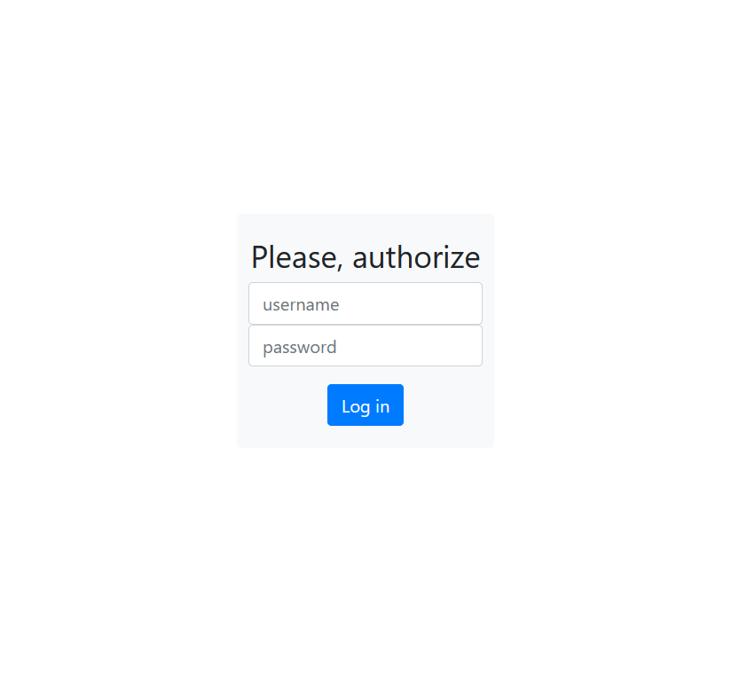
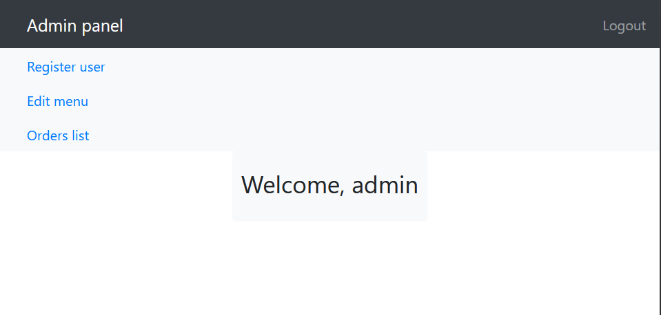
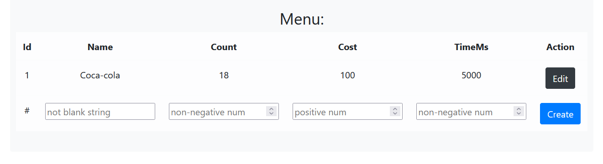
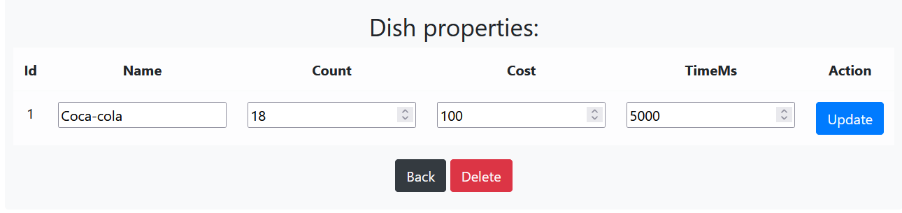
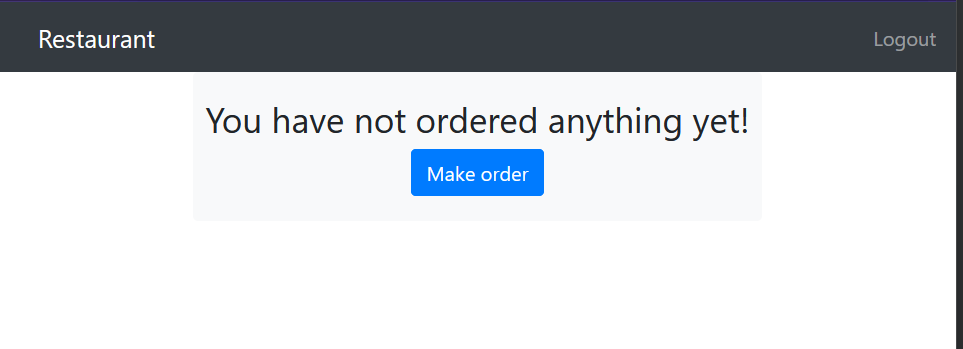
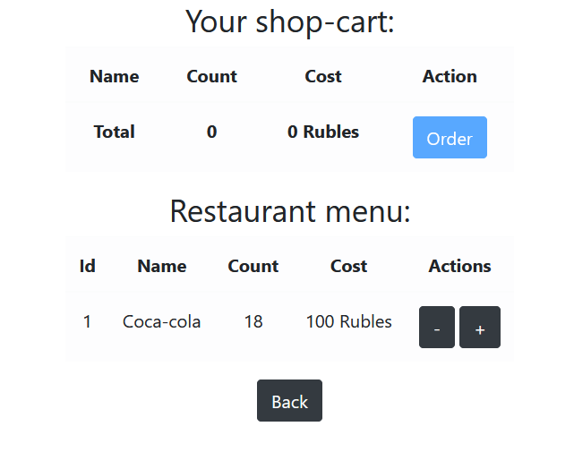
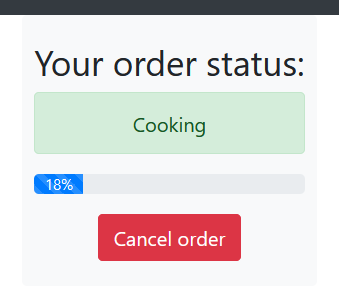
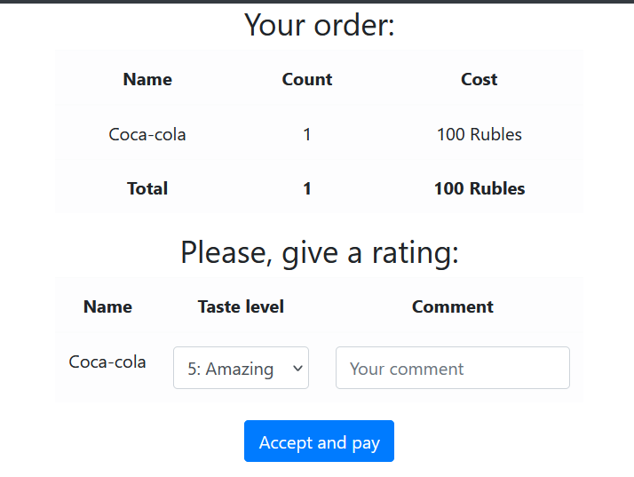
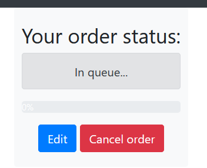
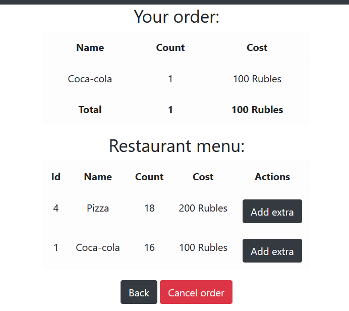

# Шамаев Онар БПИ-227
# ДЗ2 Система управления заказами в ресторане
## О работе:
Работа представляет из себя веб-сервис, написанный на Spring Framework,
с использованием Thymeleaf для генерации веб-страниц и SpringSecurity для контроля авторизации.
Данные веб-сервиса хранятся в базе данных PostgresSQL, разворачиваемой в контейнере Docker. Для верстки веб страниц использовался
веб фреймворк Bootstrap (только визуальная составляющая).

Реализованы все требуемые функции, в том числе опциональные.
В отличие от консольного приложения, веб-интерфейс куда более интуитивен и удобен.
Архитектура приложения проектировалась по принципам ООП и SOLID.
## Запуск:
Для работы веб-приложения потребуется установить Docker. В репозитории расположен скрипт
`docker-compose.yml`. Этот скрипт создаст и запустит контейнер с образом БД PostgresSQL.
Скрипт можно запустить через интерфейс Intellij IDEA, либо через терминал командой `docker compose up`.

Теперь, в любой момент, когда контейнер с БД запущен,
можно запустить основной веб-сервис `Phw2Application.kt`.
При каждом запуске он будет пытаться добавить необходимые таблицы в БД.

## Туториал:
Веб сервис доступен по адресу `localhost:8080`.
Открыв сайт, мы попадаем на страницу авторизации.

Вводим логин и пароль от любого созданного в системе аккаунта
(по умолчанию создаётся администратор с логином `admin`, паролем `admin`).
Введя правильные данные, мы окзываемся в админке.

Присутствуют разделы `Register user` - для добавления нового пользователя/администратора,
`Orders list` - для просмотра списка произведённых заказов и просмотра итоговой выручки и
`Edit menu` - для просмотра списка блюд, создания и редактирования блюд. Кнопка `Logout` - выйти из аккаунта.

Первые два раздела очень просты, и не содержат сколько-либо непривычного интерфейса.
Поэтому рассмотим раздел `Edit menu`.

Существующие блюда отображаются в списке. Каждое блюдо можно отредактировать,
нажав соответствующую блюду кнопку `Edit`. Также можно создать новое блюдо, заполнив соответствующие
поля, и нажав кнопку `Create`.

Форма для изменения блюда аналогична форме создания блюда.

После того, как в систему добавят пользователей(через форму в разделе `Register user`).
Можно будет войти в меню ресторана для пользователей (просто авторизовавшись через пользователя).

Для пользователей основная страница является главным интерактивным разделом
и может меняться в зависимости от совершённых пользователем действий.
Если пользователь ничего ещё не заказал, то ему будет предложено это сделать.

Меню создания заказа позволяет добавлять существующие блюда в заказ пользователя.
Заказ можно оформить, нажав соответствующую кнопку `Order`.

Если другие заказы сейчас не готовятся и для повара есть свободное место, то
заказ начинает своё приготовление мгновенно.

Как только заказ будет готов, то пользователю будет предложено продолжить оплату заказа и оценить сам заказ.
Пока заказ не будет оплачен, пользователь не сможет сделать новый заказ.

Если же "кухня полностью занята", то заказ встаёт в очередь. Пока заказ обрабатывается (то есть он в очереди),
его можно дополнить.

Меню изменения заказа доступно до тех пор, пока заказ не начал готовиться.

На этом разбор основных элементов интерфейса и туториал кончаются.

## Тонкости работы программы:
Если завершить работу веб-сервиса, то все повара сохранят свой прогресс.
При следующем запуске веб-сервиса они продолжат свою работу.

Заказы потребляют запасы блюд.
При отмене заказа, использованные запасы восстанавливаются.

Пользователь не имеет доступа к админ-панели.
Администратор не имеет доступа к меню заказа блюд.

Так как с веб-сервисом могут взаимодействовать несколько пользователей одновременно,
то при попытке сделать заказ действие может быть отменено,
если какой-либо другой пользователь, например, исчерпал запасы блюд.

Приоритет заказов определяется их стоимостью. Чем больше стоит заказ, тем раньше его начнут готовить.
## Паттерны:
По мере разработки веб-сервиса встречались разные паттерны проектирования, применяемые в Spring Framework
(например, паттерн строителя или даже стратегия).
Однако паттерны должны использоваться только там, где они необходимы, поэтому просто так как можно больше паттернов пихать в программу я не стал.
Такие неявные паттерны, как, например, шаблонный метод упоминать не собираюсь. Выделить хочу два явных паттерна: модифицированные наблюдатель и мементо.

Использование паттерна мементо обусловлено необходимостью сохранять состояние и прогресс поваров. Это паттерн модифицирован. Объект мементо определяется, как generic-тип соответсвтующего интерфейса.

Использование паттерна наблюдателя обусловлено необходимостью оповещать модератора о готовности заказа. Этот паттерн модифицирован, поэтому наблюдателем является повар (повара оповещают модератора о готовности), а не модератор.

Кроме того, используя SpringFramework и Thymeleaf, архитектура проекта обретает паттерн MVC.
## Тонкости реализации проекта:
В проекте, по возможности, все классы наследуются от соответсвтующих интерфейсов.

Код веб-сервиса декомпозирован. Пользователям системы отведены отдельные контроллеры. Html код веб-страниц также декомозирован, за счёт возможностей конкатенации страниц Thymeleaf.

Принцип единой ответственности имплементирован по максимому.
Корректность полей сущеностей определяется в самих сущностях.
Кроме того, таблица БД для сущностей определяются самой сущностью
(не приходится делать проливку БД отдельно - это происходит автоматически за счёт придуманных мною аннотаций и генератора запроса по ним)

По умолчанию одновременно работать может только один повар (это определяет константа `maxCookers` в компоненте RuntimeModerator, и её можно поменять).
Однако это сделано специально, чтобы можно было со второго аккаунта пользователя застать панель ожидания и изменения заказа. Повара представляют из себя Thread и работают в отдельных потоках.